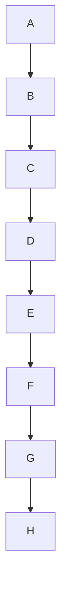

# Strategy Pattern

This pattern is all about separating What **vary** from **What Stays the same**

Identify the aspects of your application that vary behaviour and separate from from what stays the same.

# Use the Strategy pattern whenever:

-   Many related classes differ only in their behaviour
-   You need different variants of an algorithm
-   An algorithm uses data that clients shouldn't know about. Use the Strategy pattern to avoid exposing complex, algorithm-specific data structures.
-   A class defines many behaviors, and these appear as multiple conditional statements in its operations. Instead of many conditionals, move related conditional branches into their own Strategy class.

StackEdit stores your files in your browser, which means all your files are automatically saved locally and are accessible **offline!**

## UML diagrams

```mermaid
graph TD
B["fa:fa-twitter IStrategy"] 
C["fa:fa-ban ConcreteStrategy1 or Algorithm1"]
D["fa:fa-ban ConcreteStrategy2 or Algorithm2"]
E["fa:fa-ban Context"]
E-.. Context Refer ..-B
C-- Implements -->B
D-- Implements -->B
```


*UML diagrams using [Mermaid](https://mermaidjs.github.io/).*
